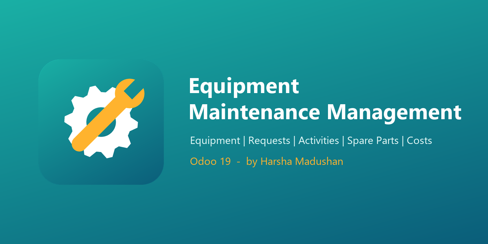

# Equipment Maintenance Management (Odoo 19)



| | |
|---|---|
| **Technical name** | `equipment_maintenance_mgmt` |
| **Version** | 19.0.1.0.0 |
| **Odoo** | 19.0 (Community / Enterprise) |
| **Author** | Harsha Madushan |
| **License** | LGPL-3 |
| **Depends on** | `base`, `mail`, `hr`, `hr_hourly_cost`, `product` |

A complete maintenance management application for a service company. It lets you:
- register the company's **equipment**
- run **maintenance requests** through a controlled workflow
- record **technician activities** (hours × labour rate) and **spare parts consumption** (quantity × unit cost)
- compute **labour, spare part and total maintenance cost** automatically
- analyse the results with **three reports**

---

## 1. Features

### Equipment master
- Equipment Name, **Serial Number** (unique per company), **Category** and hierarchical **Location** (e.g. *Colombo Plant / Workshop A*).
- **Purchase Date**, **Warranty Expiry Date** and **Responsible Employee** (`hr.employee`).
- Automatic **warranty status** (Under Warranty / Expiring Soon / Expired / No Warranty) that you can filter on.
- Smart buttons: open / all requests and the total maintenance cost of the asset.
- Maintenance history tab, chatter (messages, followers, activities), archiving.

### Maintenance requests
- **Request Number** generated automatically: `MR/2026/00001`.
- Fields: Equipment, Request Date, Request Type (Corrective / Preventive / Inspection / Calibration), Description, Assigned Technician, Priority (Low → Urgent), Status and colour **Tags** (Electrical, Safety, Warranty Claim...).
- On choosing the equipment, a **warning** appears if it already has open requests (to avoid duplicates) or is still under warranty.
- Only the **assigned technician** (or a manager) can start and complete the job.
- **Workflow:** `New → Assigned → In Progress → Completed / Cancelled`, with *Reset to New* after a cancellation.
- The technician gets a **to-do activity** when assigned. Overdue requests are highlighted and a daily reminder is posted.
- Kanban board by status, list, calendar (planning by scheduled date) and activity views.

### Activities, spare parts and costs
- **Activities:** description, technician, hours spent, labour rate and cost.
  - The labour rate defaults to the technician's employee *Hourly Cost*, or else to the company's default labour rate.
- **Spare parts:** product, quantity, unit cost (defaults to the product cost) and total cost.
- **Costs:**
  - Labour Cost = Σ activity cost
  - Spare Part Cost = Σ part cost
  - **Total Maintenance Cost = Labour + Spare Parts**
- Lines are **locked** once a request is completed or cancelled.

### Reporting
| Report | Where |
|---|---|
| **Equipment maintenance history** | *Reporting > Equipment Maintenance History*, and the **Print History** PDF on the equipment form |
| **Maintenance cost analysis** | *Reporting > Maintenance Cost Analysis* (pivot, graph, list by category, equipment, technician, month...) |
| **Pending maintenance** | *Reporting > Pending Maintenance* (grouped by technician, overdue in red), plus the **Pending Maintenance Summary** PDF |
| Work order | **Print** button on a request (PDF with activities, parts, costs and signatures) |

### Security
| Group | Can do |
|---|---|
| **Technician** | Read equipment. Create requests. See and work on the requests **assigned to them or reported by them**. Record activities and parts on those requests. No deletion. |
| **Manager** | Everything: equipment, all requests, deletion (new / cancelled only), configuration and reports. |

Multi-company record rules are applied on every model.

---

## 2. Installation

1. Copy the `equipment_maintenance_mgmt` folder into a directory on your Odoo `addons_path`. You can also add its parent folder to the path:
   ```
   odoo-bin -c odoo.conf --addons-path="<odoo>/addons,C:\path\to\Final Assestment"
   ```
2. Restart Odoo and update the Apps list (developer mode → *Apps > Update Apps List*).
3. Search for **Equipment Maintenance Management** and click **Activate**.
   Or use the command line: `odoo-bin -c odoo.conf -d <db> -i equipment_maintenance_mgmt`

Demo data (6 equipment, 8 requests in every state, 2 technicians, 1 manager) loads only when the database was created with demo data.

## 3. Configuration

1. **Users:** *Settings > Users*. In the **Equipment Maintenance** privilege, select *Technician* or *Manager*.
2. **Labour rate:** set the *Hourly Cost* on each technician's employee (HR tab), or a company default under *Equipment Maintenance > Configuration > Settings > Default Labour Rate*.
3. **Warranty alert:** the number of days before expiry at which equipment shows *Expiring Soon* (default 30), in the same Settings screen.
4. **Master data:** *Configuration > Equipment Categories*, *Locations* and *Tags*.

Assumptions made where the brief is silent (technician = user, labour rate source, no stock moves, etc.) are listed in [TECHNICAL.md §3.6](TECHNICAL.md).

## 4. Usage (quick walkthrough)

1. *Equipment > New*: enter the name, serial number, category, location, purchase and warranty dates, and the responsible employee.
2. On the equipment, click **New Request**. Choose the type, priority and scheduled date, then describe the problem.
3. Select a **technician**. The request becomes **Assigned** and the technician receives a to-do.
4. The technician clicks **Start** → *In Progress*.
5. In the **Activities** tab, add the work performed and hours. In the **Spare Parts** tab, add the parts used. Costs update live.
6. Click **Complete**. At least one activity is required. The equipment's total cost and last maintenance date update.
7. Managers analyse costs under **Reporting**.

## 5. Tests

```
odoo-bin -c odoo.conf -d <test_db> -i equipment_maintenance_mgmt --test-enable \
         --test-tags /equipment_maintenance_mgmt --stop-after-init
```
There are 5 test classes (equipment, workflow, costs, security, reports). See [docs/testing/test_plan.md](docs/testing/test_plan.md).

A static consistency check that needs no server: `python docs/tools/static_check.py`

## 6. Documentation

| Document | Content |
|---|---|
| [TECHNICAL.md](TECHNICAL.md) | Architecture, data model, compute chain, security matrix, reports |
| [docs/evaluation_criteria_coverage.md](docs/evaluation_criteria_coverage.md) | How each evaluation criterion is met (with file references) |
| [docs/README.md](docs/README.md) | **Learning pack**: phase-by-phase learning cycles, business flow, coding standards, presentation script, test plan |

---
Author: **Harsha Madushan** · Odoo 19 Practical Evaluation
