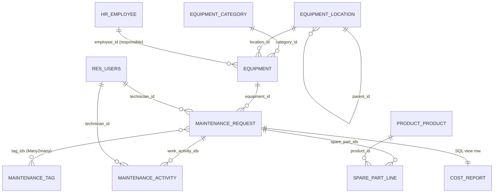
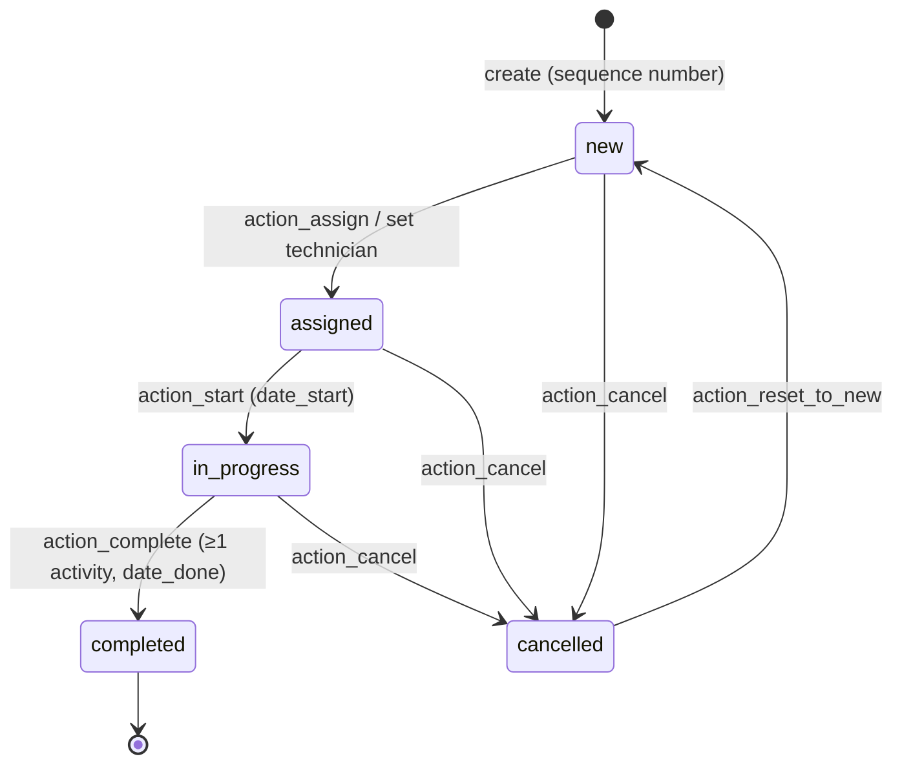

# Technical Documentation: `equipment_maintenance_mgmt`

Author: **Harsha Madushan** · Target: **Odoo 19.0** · License: LGPL-3

---

## 1. Architecture overview

```
equipment_maintenance_mgmt/
├── __init__.py / __manifest__.py
├── models/
│   ├── res_company.py                        default labour rate, warranty alert days
│   ├── res_config_settings.py                settings screen (related fields)
│   ├── equipment_maintenance_category.py     equipment.maintenance.category
│   ├── equipment_maintenance_location.py     equipment.maintenance.location (hierarchical)
│   ├── equipment_maintenance_equipment.py    equipment.maintenance.equipment
│   ├── equipment_maintenance_request.py      equipment.maintenance.request (workflow + costs)
│   ├── equipment_maintenance_tag.py          equipment.maintenance.tag (Many2many tags)
│   ├── equipment_maintenance_line_mixin.py   equipment.maintenance.line.mixin (abstract)
│   ├── equipment_maintenance_activity.py     equipment.maintenance.activity
│   └── equipment_maintenance_spare_part.py   equipment.maintenance.spare.part
├── report/
│   ├── equipment_maintenance_cost_report.py          SQL-view model (cost analysis)
│   ├── equipment_maintenance_cost_report_views.xml   pivot/graph/list + history action
│   ├── equipment_maintenance_reports.xml             ir.actions.report (3 PDFs)
│   └── *_templates.xml                               QWeb templates
├── security/  equipment_maintenance_mgmt_groups.xml, ir.model.access.csv,
│              equipment_maintenance_equipment_security.xml, equipment_maintenance_request_security.xml
├── data/      ir_sequence_data.xml, equipment_maintenance_category_data.xml,
│              equipment_maintenance_tag_data.xml, mail_activity_type_data.xml, ir_cron_data.xml
├── demo/      equipment_maintenance_demo.xml
├── views/     one *_views.xml per model, res_config_settings_views.xml, equipment_maintenance_mgmt_menus.xml
├── tests/     common.py + 5 test files
├── static/description/  icon.png, icon.svg, banner.png, index.html
└── docs/      learning pack, tools (static_check.py, make_icons.py)
```

**Dependencies**

| Module | Why |
|---|---|
| `base` | ORM, users, companies, sequences, crons |
| `mail` | `mail.thread` (chatter, tracking), `mail.activity.mixin` (to-dos) |
| `hr` | Responsible Employee (`hr.employee`), user ↔ employee link |
| `hr_hourly_cost` | `hr.employee.hourly_cost`, the default labour rate of a technician |
| `product` | Spare parts are `product.product` records (standard cost) |

---

## 2. Data model



### 2.1 `equipment.maintenance.equipment`
Inherits `mail.thread`, `mail.activity.mixin` and `image.mixin`. Has `_check_company_auto` and `_rec_names_search = ['name', 'serial_no']`.

| Field | Type | Notes |
|---|---|---|
| name | Char, required | Equipment Name |
| serial_no | Char, required | `models.Constraint UNIQUE(serial_no, company_id)`, `copy=False` |
| category_id | Many2one category | required, `ondelete=restrict` |
| location_id | Many2one location | hierarchical |
| purchase_date / warranty_expiry_date | Date | `_check_dates`: purchase not in future, warranty ≥ purchase |
| employee_id | Many2one `hr.employee` | Responsible Employee |
| company_id, currency_id, purchase_cost, model, manufacturer, note, active, color | | |
| request_ids | One2many request | |
| request_count / open_request_count | Integer (compute, `_read_group`) | smart button |
| total_maintenance_cost | Monetary (compute, **stored**) | Σ total_cost of **completed** requests |
| last_maintenance_date | Date (compute, stored) | max `date_done` of completed requests |
| warranty_state | Selection (compute, **search method**) | none / valid / expiring / expired |
| warranty_days_left | Integer (compute) | |

### 2.2 `equipment.maintenance.request`
Inherits `mail.thread` and `mail.activity.mixin`. Ordered by `priority desc, request_date desc`.

| Field | Type | Notes |
|---|---|---|
| name | Char | sequence `equipment.maintenance.request` → `MR/%(year)s/00001` (set in `create`) |
| equipment_id | Many2one | required; `_check_equipment_id` refuses archived equipment |
| request_date / scheduled_date | Date | `_check_scheduled_date`: scheduled ≥ requested |
| request_type | Selection | corrective / preventive / inspection / calibration |
| description, resolution_note | Html | |
| technician_id | Many2one `res.users` | domain = internal users in the Technician group (`all_group_ids`) |
| tag_ids | **Many2many** `equipment.maintenance.tag` | relation table `equipment_maintenance_request_tag_rel`; `many2many_tags` widget with colours |
| priority | Selection '0'..'3' | `widget="priority"` |
| state | Selection | new / assigned / in_progress / completed / cancelled, `group_expand=True` (all kanban columns) |
| category_id, location_id | related, **stored** | used for grouping in reports |
| employee_id | related | |
| date_start / date_done / duration | Datetime / Float (stored compute) | |
| is_overdue | Boolean (compute + search) | scheduled < today and still open |
| work_activity_ids / spare_part_ids | One2many | named `work_activity_ids` to avoid clashing with `activity_ids` of `mail.activity.mixin` |
| total_hours, labour_cost, spare_part_cost, total_cost | stored computes, `aggregator='sum'` | cost engine |

### 2.3 Lines: `equipment.maintenance.line.mixin` (abstract)
Shared by activities and spare parts:
- Fields: `request_id` (cascade), `request_state`, stored `equipment_id` / `company_id`, `currency_id`.
- `create`, `write` and `@api.ondelete` call `_check_request_editable()`, which raises a `UserError` on lines of completed or cancelled requests.

| `equipment.maintenance.activity` | |
|---|---|
| name, technician_id (default = request technician or current user), date | |
| hours_spent | `CHECK(hours_spent > 0)` + `_check_hours_spent` (≤ 24) |
| labour_rate | compute, **stored, editable, precompute**: employee `hourly_cost` (read with `sudo`) or `company.maintenance_labour_rate` |
| cost | stored compute = hours × rate |

| `equipment.maintenance.spare.part` | |
|---|---|
| product_id | `product.product`, domain `type = consu` |
| name | editable compute from the product |
| quantity | `CHECK(quantity > 0)`, digits `Product Unit` |
| uom_id | related product UoM |
| unit_cost | compute, stored, editable, precompute = `product.standard_price` (company dependent) |
| total_cost | stored compute = quantity × unit cost |

### 2.4 Configuration models
- `equipment.maintenance.category`: name (unique per company), code, color, `equipment_count`.
- `equipment.maintenance.tag`: name (unique), color (random default via `_default_color`), inverse Many2many `request_ids`.
- `equipment.maintenance.location`: `_parent_store`, `complete_name` (recursive stored compute), recursion check with `_has_cycle()`.
- `res.company`: `maintenance_labour_rate`, `maintenance_warranty_alert_days`. These are exposed in `res.config.settings` through related fields.

---

## 3. Business logic

### 3.1 Workflow (state machine)



- The transitions are declared once in `ALLOWED_TRANSITIONS`. `_check_state_transition()` guards every action button and raises a `UserError` otherwise.
- `create()`: gets the sequence number (company aware) and auto-assigns when a technician is given.
- `write()`: setting a technician on a *new* request moves it to *assigned*. A technician change replans the to-do.
- `_schedule_technician_todo()` uses `activity_schedule()` with the `mail_activity_data_maintenance_todo` type. The to-do is marked done on completion (`activity_feedback`) and removed on cancellation (`activity_unlink`).
- `@api.ondelete(at_uninstall=False) _unlink_except_processed`: only *new* or *cancelled* requests can be deleted.

### 3.2 Cost computation chain

```
activity.hours_spent ─┐
activity.labour_rate ─┴─► activity.cost ───────┐
                                               ├─► request.labour_cost ─────┐
part.quantity  ─┐                              │                            ├─► request.total_cost ─► equipment.total_maintenance_cost
part.unit_cost ─┴─► part.total_cost ───────────┴─► request.spare_part_cost ─┘        (completed requests only)
```

Every arrow is a stored compute declared with `@api.depends`, so the ORM recomputes the whole chain when any input changes (edit, add or delete a line). The values are stored, so they can be searched, grouped, summed in list views (`sum=`) and read by the SQL-view report.

**Example (demo request "CNC completed")**
- Nimal: 4 h × 2 000 = 8 000
- Kasun: 2 h × 1 500 = 3 000
- 4 bearings × 850 = 3 400
- **Total = 14 400**

### 3.3 Validations summary

| Rule | Where | Type |
|---|---|---|
| Serial number unique per company | equipment `_serial_no_company_uniq` | SQL constraint |
| Category name unique per company | category `_name_company_uniq` | SQL constraint |
| Purchase date not in future; warranty ≥ purchase | `_check_dates` | `@api.constrains` |
| No recursive locations | `_check_parent_id` | `@api.constrains` |
| Scheduled date ≥ request date | `_check_scheduled_date` | `@api.constrains` |
| No request on archived equipment | `_check_equipment_id` | `@api.constrains` |
| Technician mandatory when assigned / in progress / completed | `_check_technician_id` | `@api.constrains` |
| Only the assigned technician (or a manager) starts / completes a job (no processing of someone else's work, e.g. a request you reported) | `_check_is_assigned_technician` | `UserError` |
| Duplicate open request on the same equipment, equipment under warranty | `_onchange_equipment_id` | onchange **warning** (non-blocking) |
| Tag name unique | tag `_name_uniq` | SQL constraint |
| Hours > 0, rate ≥ 0, qty > 0, unit cost ≥ 0 | line models | SQL constraints |
| Hours ≤ 24 per line | `_check_hours_spent` | `@api.constrains` |
| Valid workflow transitions | `_check_state_transition` | `UserError` |
| Technician required to assign | `action_assign` | `UserError` |
| ≥ 1 activity to complete | `action_complete` | `UserError` |
| Lines locked on closed requests | `_check_request_editable` | `UserError` |
| Delete only new / cancelled | `_unlink_except_processed` | `@api.ondelete` |

### 3.4 ORM methods and framework features used

| Feature | Where |
|---|---|
| `create()` (`@api.model_create_multi`) | request (sequence, auto-assign, to-do); line mixin (lock check) |
| `write()` | request (implicit assignment, to-do replanning); line mixin (lock check) |
| `unlink()` | protected with `@api.ondelete(at_uninstall=False)` on request and lines (the Odoo-recommended hook instead of overriding `unlink`); exercised in tests |
| `search()` | crons, onchange duplicate check, technician domain test; `_read_group` for counters |
| `browse()` | line mixin (`browse(request_ids)` before create), activity default technician |
| `copy_data()` | equipment "(copy)" |
| Sequences | `ir.sequence` `equipment.maintenance.request` |
| Chatter tracking | `mail.thread` + `tracking=True` on key fields of equipment and request |
| Computed fields | stored, non-stored + `search=`, editable (`readonly=False`, `precompute`), recursive, multi-field |
| Onchange | `_onchange_equipment_id` (warnings); defaults that must stay editable use computes, as recommended since Odoo 13+ |
| Constraints | `models.Constraint` (SQL) and `@api.constrains` (Python) |
| Default values | `default=` (dates, company, priority, state, hours), `_default_technician_id`, `_default_color`, `_default_technician_domain` |
| Relational fields | Many2one (many), One2many (`request_ids`, `work_activity_ids`, `spare_part_ids`, `child_ids`), **Many2many** (`tag_ids`) |
| Inheritance | `_inherit` of mixins (`mail.thread`, `mail.activity.mixin`, `image.mixin`), own AbstractModel mixin, extension of `res.company` / `res.config.settings`, view inheritance (settings) |

### 3.5 Scheduled actions (`data/ir_cron_data.xml`)

| Cron | Method | Effect |
|---|---|---|
| Warranty expiry reminder (daily) | `equipment._cron_warranty_expiry_reminder()` | *Warranty Expiry* activity for the responsible employee's user, created once |
| Overdue request reminder (daily) | `request._cron_overdue_requests()` | Note on each overdue request that notifies the technician |

---

### 3.6 Assumptions (details not specified in the brief)

| Topic | Assumption |
|---|---|
| Technician | An Odoo **user** (logs in, receives to-dos); cost rate from the linked employee |
| Labour rate | The employee *Hourly Cost* (`hr_hourly_cost`), else a company default rate; editable per line |
| Spare parts | Existing `product.product` goods; unit cost = product cost, editable. No stock moves (inventory not required by the brief) |
| Location | Internal hierarchical list (not `stock.location`), so no Inventory dependency |
| Equipment cost | Only **completed** requests count as the actual cost of the asset; open ones appear in the cost analysis |
| Workflow | "Assigned" requires a technician; completion requires at least one activity; cancelled requests can be reset to New |
| Who processes | The assigned technician (or a manager) starts and completes the job |
| Deletion | Only managers, only new or cancelled requests |
| Warranty | "Expiring Soon" = within N days (setting, default 30) |
| Currency | Company currency |

### 3.7 Technical design decisions

| Decision | Reason |
|---|---|
| Standalone module (not extending `maintenance`) | Demonstrates full modelling; avoids coupling; prefix `equipment.maintenance.*` avoids clashes |
| Workflow as data (`ALLOWED_TRANSITIONS`) + one guard method | Single source of truth, easy to extend or override |
| Stored cost computes | Sums in lists, pivot aggregation, SQL-view report, tracking |
| Non-stored `warranty_state` + search method | Depends on today; always correct yet filterable |
| Editable computes instead of onchange for defaults | Work through ORM, imports and RPC, not only in the form |
| AbstractModel line mixin | Locking and shared fields written once |
| `sudo()` only for `hourly_cost` | HR-restricted field; technicians never read HR data |
| SQL-view report via `_table_query` | Fast flat dataset for analysis, separate ACL, Odoo 19 pattern |
| Record rules OR-ed by group, company rules global | Technician isolation, manager override, multi-company safety |
| Demo data through `<function>` calls | Demo follows the real workflow, proving the logic |

## 4. Security

### 4.1 Groups (Odoo 19 privilege model)
`res.groups.privilege` **Equipment Maintenance** (category *Supply Chain*):
- `equipment_maintenance_mgmt_group_technician` implies `base.group_user`.
- `equipment_maintenance_mgmt_group_manager` implies Technician. Admin and root are members.

### 4.2 Access rights (`ir.model.access.csv`)

| Model | Technician | Manager |
|---|---|---|
| category, location, equipment, tag | R | CRUD |
| request | R W C | CRUD |
| activity, spare part | CRUD (limited by rules) | CRUD |
| cost report | none | R |

### 4.3 Record rules

| Rule | Domain | Groups |
|---|---|---|
| `*_rule_company` (all models) | `company_id in company_ids` (category and location also allow `False`) | global |
| `equipment_maintenance_request_rule_technician` | `technician_id = user OR create_uid = user` | Technician |
| `equipment_maintenance_activity_rule_technician` / `..._spare_part_rule_technician` | same, through `request_id.` | Technician |
| `*_rule_manager` | `[(1, '=', 1)]` | Manager |

Group rules are OR-ed, so a manager's `(1=1)` rule overrides the technician restriction. Global company rules are AND-ed with everything.

**Sensitive data:** `hr.employee.hourly_cost` is restricted to HR officers. The activity reads it with `sudo()` only to default the rate, so technicians never read HR data directly.

---

## 5. User interface

| Menu | Action | Views |
|---|---|---|
| Maintenance > My Requests | `equipment_maintenance_request_action_my` | kanban, list, form, calendar, activity |
| Maintenance > All Requests | `equipment_maintenance_request_action` | same |
| Maintenance > Technician Activities / Spare Parts Consumption | line actions | list (grouped) |
| Equipment | `equipment_maintenance_equipment_action` | kanban, list, form |
| Reporting (Manager) | cost analysis, pending, history | pivot, graph, list |
| Configuration (Manager) | settings, categories, locations | |

Odoo 19 view features used:
- `<list>` views and `invisible` / `readonly` / `required` Python expressions (no `attrs`)
- `<chatter/>`
- `web_ribbon`, `widget="statusbar"` / `priority` / `badge` / `many2one_avatar_user` / `many2one_avatar_employee`
- kanban `t-name="card"` templates, `group_expand` columns
- `column_invisible`, `optional`, `sum`
- calendar with `avatar_field`
- search panels with filters and group-bys, the `date` filter

---

## 6. Reports

| Report | Model | Technical |
|---|---|---|
| Maintenance Cost Analysis | `equipment.maintenance.cost.report` | `_auto = False`, `_table_query` property returning `SQL(...)`: one row per request joined with equipment and company; pivot, graph, list |
| Pending Maintenance | request | window action, domain on open states, grouped by technician, overdue decoration; PDF `report_pending_maintenance` |
| Equipment Maintenance History | request + equipment | window action grouped by equipment; PDF `report_equipment_history` (manager only via `group_ids`) |
| Maintenance Work Order | request | PDF `report_maintenance_request` |

---

## 7. Tests (`tests/`)

| File | Covers |
|---|---|
| `common.py` | fixtures: 2 technicians (A with hourly cost 1500, B without), manager, company rate 1000, master data, helpers |
| `test_equipment.py` | display/name search, serial unique, date constraints, warranty compute and search, counters, copy, warranty cron, location recursion |
| `test_request_workflow.py` | sequence, Form creation, auto-assign and to-do, all transitions and guards, unlink rule, line locking, overdue, duration, Many2many tags, onchange warnings, technician required, cron |
| `test_costs.py` | labour rate defaults and override, spare part defaults, request totals, recompute on edit/delete, equipment rollup, constraints |
| `test_security.py` | technician isolation, create_uid rule, technician works end to end, only the assigned technician processes, no delete, no equipment write, no cost report, manager sees all |
| `test_reports.py` | SQL view totals and grouping, QWeb rendering of the 3 PDFs |

Run: `--test-enable --test-tags /equipment_maintenance_mgmt` (tests are `post_install`).

---

## 8. Odoo 19 specifics applied (verified in the Odoo 19 source)

| Topic | Odoo 19 way | Source reference |
|---|---|---|
| SQL constraints | `_x = models.Constraint('CHECK(...)', msg)` (no `_sql_constraints`) | `odoo/orm/table_objects.py` |
| Groups | `res.groups.privilege` + `privilege_id`; members in `user_ids` | `odoo/addons/base/models/res_groups*.py`, `addons/maintenance/security/maintenance.xml` |
| User groups | `res.users.group_ids` / `all_group_ids` (searchable) | `base/models/res_users.py` |
| Translations | `self.env._("...")` with named placeholders | `odoo/orm/environments.py` |
| Domains | `from odoo.fields import Domain`, `Domain.OR([...])` | `odoo/orm/domains.py` |
| Non-stored field search | operators normalised to `in` / `not in`; `return NotImplemented` lets the ORM negate | `addons/project/models/project_task.py::_search_is_closed` |
| Selection kanban columns | `group_expand=True` | `odoo/orm/fields_selection.py` |
| Report groups | `ir.actions.report.group_ids` | `base/models/ir_actions_report.py` |
| SQL report | `_table_query` property + `odoo.tools.SQL` | `addons/hr_timesheet/report/timesheets_analysis_report.py` |
| Aggregation | `aggregator='sum'` (replaces `group_operator`) | `odoo/orm/fields.py` |
| Views | `<list>`, `<chatter/>`, `invisible="expr"`, kanban `card` template | `addons/maintenance/views/maintenance_views.xml` |
| Settings | `<app>` / `<block>` / `<setting>` | `addons/maintenance/views/res_config_settings_views.xml` |
| HR access | internal users read `hr.employee` through the public-profile fallback; `hourly_cost` restricted to HR | `addons/hr/models/hr_employee.py`, `addons/hr_hourly_cost` |
