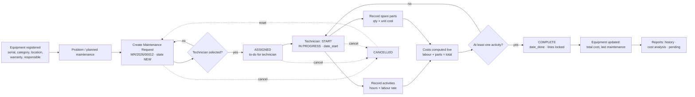

# Business Flow: Equipment Maintenance Management

## 1. The business problem
A service company owns many assets (machines, vehicles, IT, HVAC). Without a system:
- nobody knows **which asset** broke, **how often**, or **what it cost**;
- requests are lost in phone calls and e-mails, and technicians do not know their priorities;
- spare parts and labour are not charged to the asset, so it is impossible to decide "repair or replace";
- warranties expire unnoticed, and the company pays for repairs that the supplier should cover.

**Goal:** a single place to register equipment, run every maintenance job from request to completion, capture labour and parts, and analyse cost.

## 2. Actors

| Actor | Odoo role | Responsibilities |
|---|---|---|
| **Requester** (any technician or employee using the app) | Technician | Report a problem on an equipment |
| **Technician** | Technician | Start the job, record activities (hours) and spare parts, complete the job |
| **Maintenance Manager** | Manager | Maintain the equipment register and master data, assign technicians, cancel or delete, analyse costs, follow pending work |
| **Responsible Employee** | `hr.employee` on the equipment | Owner of the asset; receives the warranty-expiry reminder |
| **System (cron)** | superuser | Daily overdue and warranty reminders |

## 3. End-to-end process



### 3.1 Status meaning

| Status | Meaning | Who moves it | Next |
|---|---|---|---|
| **New** | Reported, not yet planned | anyone (create) | Assigned, Cancelled |
| **Assigned** | A technician is responsible; a to-do is in their inbox | Manager / requester (select technician or *Assign*) | In Progress, Cancelled |
| **In Progress** | Work started (`date_start`) | Technician (*Start*) | Completed, Cancelled |
| **Completed** | Work done (`date_done`); costs frozen | Technician (*Complete*) | none (final) |
| **Cancelled** | Not needed / duplicate (reason recorded) | Technician / Manager (*Cancel*) | New (*Reset to New*) |

### 3.2 Business rules (and why)

| Rule | Reason |
|---|---|
| Serial number unique per company | One physical asset = one record |
| Purchase date cannot be in the future; warranty ends after purchase | Data quality |
| Requests cannot be opened on archived (scrapped) equipment | No work on assets that are out of service |
| A request needs a technician to be assigned | Accountability |
| Completion needs at least one activity | No "empty" completed jobs; labour is always captured |
| Scheduled date ≥ request date | Consistency |
| Hours per activity line > 0 and ≤ 24; quantities > 0; costs ≥ 0 | Prevents typing errors |
| Lines are frozen after completion or cancellation | The recorded cost of a closed job cannot change |
| Only new or cancelled requests can be deleted, by managers | Audit trail of real work |
| Technicians see only their own (assigned or reported) requests | Confidentiality and focus |

## 4. Cost model

```
Labour cost      = Σ (hours spent × labour rate)     for each activity
Spare part cost  = Σ (quantity × unit cost)          for each part line
Total cost       = Labour cost + Spare part cost      per request
Equipment cost   = Σ total cost of COMPLETED requests
```

- **Labour rate:** the technician's *Hourly Cost* (HR employee), or else the company *Default Labour Rate*. It is editable per line (overtime, contractor).
- **Unit cost:** the product *Cost*. Editable per line (special purchase price).

**Example (demo "CNC Lathe, 6-monthly preventive maintenance"):**

| | Qty/Hours | Rate/Cost | Amount (LKR) |
|---|---|---|---|
| Replace spindle bearings (Nimal) | 4 h | 2 000 | 8 000 |
| Lubrication and alignment (Kasun) | 2 h | 1 500 | 3 000 |
| Ball Bearing 6205 | 4 | 850 | 3 400 |
| **Total maintenance cost** | | | **14 400** |

## 5. Reports and the decisions they support

| Report | Question answered | Decision |
|---|---|---|
| **Equipment maintenance history** | What happened to this asset, when, by whom, at what cost? | Repair vs replace; supplier warranty claims; audits |
| **Maintenance cost analysis** (pivot/graph) | Where does the maintenance budget go (category, location, technician, type, month)? | Budgeting; preventive vs corrective balance; outsourcing |
| **Pending maintenance** | What is still open, for whom, and what is late? | Daily dispatching; workload balancing; escalation |
| Work order PDF | What must the technician do and sign? | Field execution; customer or supervisor sign-off |

## 6. Automations
| Trigger | Action |
|---|---|
| Technician set on a request | Request → *Assigned*; to-do activity for the technician (deadline = scheduled date) |
| Technician changed | Old to-do removed, new one planned |
| Request completed | To-do marked done |
| Request cancelled | To-do removed |
| Daily: request overdue | Note posted and technician notified |
| Daily: warranty expires within N days (default 30) | *Warranty Expiry* activity for the responsible employee's user (once) |

## 7. Mapping to the evaluation requirements

| PDF requirement | Where in the module |
|---|---|
| 1. Equipment Master (7 fields) | *Equipment* menu, model `equipment.maintenance.equipment` |
| 2. Maintenance Request + workflow | *Maintenance > All Requests*, model `equipment.maintenance.request` |
| 3. Maintenance Activities | *Activities* tab, model `equipment.maintenance.activity` |
| 4. Spare Parts Consumption | *Spare Parts* tab, model `equipment.maintenance.spare.part` |
| 5. Cost Calculation | *Costs* group on the request; equipment total |
| 6. Reporting (3 reports) | *Reporting* menu + PDFs |
| Security, groups, record rules | *Settings > Users* (privilege "Equipment Maintenance") |
| Validations, computed fields, ORM | see TECHNICAL.md §3 |
| README.md / TECHNICAL.md | module root |
